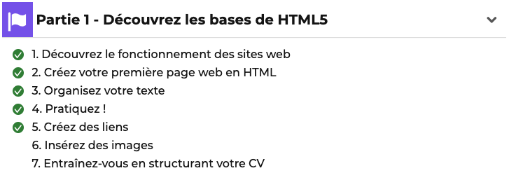

# Entraînez-vous en structurant votre CV

**À vous de jouer !** Pour vous entraîner, réalisez cet exercice étape par étape.

Une fois que vous avez terminé, vous pouvez comparer, auto-évaluer, votre
travail avec ma **Check-list**

## Contexte

Vous cherchez du travail et vous décidez de créer votre CV en ligne.
Pour cela, vous allez devoir créer votre première page HTML.

**Avant de commencer**, réaliser les 7 chapitres de la [Partie 1 - Découvrez les base de HTML5 ](https://openclassrooms.com/fr/courses/1603881-apprenez-a-creer-votre-site-web-avec-html5-et-css3)
, le 7e étant cet exercice 😀

## Votre mission

* Étape 1 : Créez une fichier `index.html`.
* Étape 2 : Ajoutez votre nom et votre prénom au en titre principal.
* Étape 3 : Ajoutez une photo miniature, sur laquelle on pourra cliquer pour avoir une version agrandie.
* Étape 4 : Ajoutez trois sections avec un titre secondaire :
  * Mon expérience (vous pouvez en inventer 😅)
  * Mes compétences
  * Ma formation
  * _Chaque section contient un paragraphe ou une liste à puce._

## Check-list

✅ La page HTML est un CV.

✅ On trouve votre nom et prénom dans l'onglet de la page.

✅ L'icône de la page s'affiche dans l'onglet.

✅ Le titre principal est un `<h1>` et contient votre nom et prénom.

✅ Une photo miniature cliquable renvoie sur la même photo agrandie.

✅ Trois sections en titre `<h2>` :
* mon expérience
* mes compétences
* ma formation

✅ Chaque section contient au minimum
un paragraphe ou une liste à puce.

## Exemples de solutions
* https://divtec-cejef.github.io/101-SFA-HTML-CV-01/
* https://static.oc-static.com/activities/198/evaluation_resources/structurez-votre-cv_exemple-2019-01-03T081950.zip